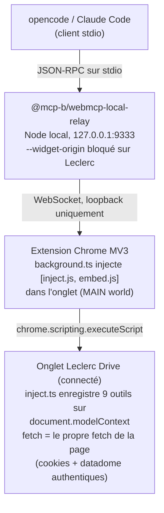

# Index de la documentation

Point d'entrée pour tout comprendre de `mcp-leclerc-drive`. Lire dans cet ordre
en première passe.

| Document | Ce qu'il couvre |
| --- | --- |
| [../README.md](../README.md) | Pitch du projet, install, les 9 outils en un coup d'œil — commencer ici. |
| [architecture.md](architecture.md) | Forme du runtime WebMCP : extension, relay, MVP-B, flux de données, couches. |
| [tools.md](tools.md) | Référence des 9 outils MCP : contrats, entrées, comportement, annotations. |
| [security.md](security.md) | Modèle de menaces : frontières de confiance, fermeture SSRF, durcissement anti-injection de prompt, permissions. |
| [api-capture.md](api-capture.md) | L'API HTTP Leclerc Drive reverse-enginé (à lire avant de toucher `src/leclerc/api.ts`). |
| [adr/](adr/) | Architecture Decision Records — le *pourquoi* derrière les choix difficiles à revenir. |
| [../CONTRIBUTING.md](../CONTRIBUTING.md) | Setup dev, build/reload de l'extension, reverse-engineering d'un nouvel endpoint, checklist PR. |
| [../CHANGELOG.md](../CHANGELOG.md) | Ce qui a changé à chaque release (courant : refactor WebMCP 1.0.0). |

## Modèle mental rapide

Invariant clé : **aucun identifiant ne quitte jamais l'onglet connecté.** La
logique métier est pure dans [`src/leclerc/api.ts`](../src/leclerc/api.ts) de
façon à se bundler dans le content script et rester unit-testable ; le seul
endroit qui appelle `fetch` est
[`extension/inject.ts`](../extension/inject.ts), en utilisant le fetch de la
page.