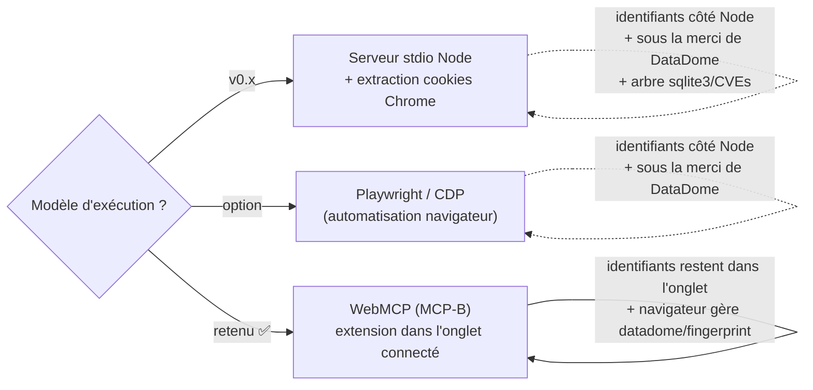

# Adopter le modèle WebMCP (browser-tab) plutôt qu'un serveur MCP stdio Node

**Statut :** accepté (remplace le design stdio Node v0.x).

Le serveur stdio Node (v0.x) lisait les cookies Chrome depuis le profil local
via `chrome-cookies-secure` et les rejouait avec un `fetch` Node. On passe au
modèle WebMCP (MCP-B) : une petite extension MV3 enregistre les outils Leclerc
dans l'onglet Chrome connecté et `@mcp-b/webmcp-local-relay` les ponte vers
n'importe quel client MCP stdio. Le facteur décisif est que DataDome et la
session vivent naturellement dans un véritable onglet navigateur — le navigateur
rafraîchit `datadome` lui-même et présente une véritable empreinte — donc la
fragilité, la surface de config credentialée (`LECLERC_COOKIE`, cookies Chrome
sur disque), et tout l'arbre de dépendances `sqlite3` (et ses CVE)
disparaissent.

**Options envisagées.** Garder le serveur stdio + extraction de cookies ; ou un
serveur d'automatisation Playwright/CDP. Les deux gardent les identifiants côté
Node et restent à la merci de DataDome.

**Conséquences.** Pas de déploiement headless / VPS (un véritable onglet Chrome
connecté est requis). Pas de binaire npm publié — le client MCP lance le relay,
l'extension se charge manuellement. Fort lock-in sur `@mcp-b/*` ; la surface
`registerTool` / `embed.js` peut évoluer (changements confinés à
`extension/inject.ts` et au script de build). Voir
[`CHANGELOG.md`](../../CHANGELOG.md) pour le delta au niveau fichier v0.x → v1.0.