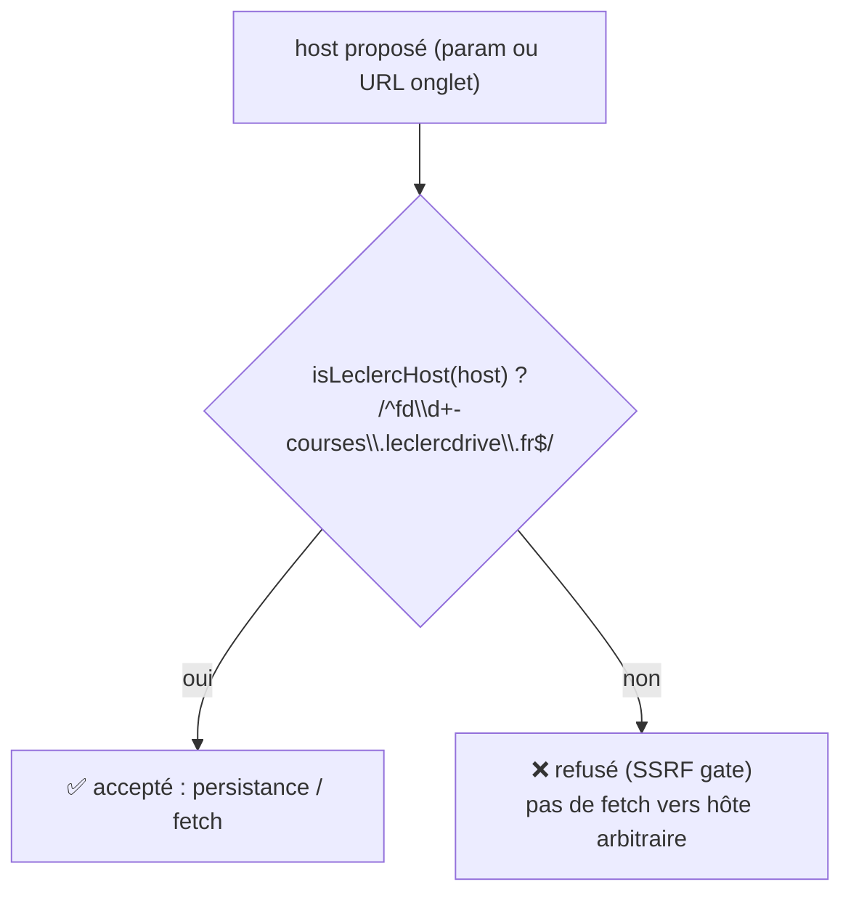

# Valider chaque hôte avec `isLeclercHost` avant tout fetch (porte SSRF)

Chaque `host` qui atteint un `fetch` d'outil doit matcher
`/^fd\d+-courses\.leclercdrive\.fr$/`. `set_store` refuse un hôte non-matchant
et `saveStore` refuse de le persister ; par défaut l'hôte est dérivé du propre
`location.host` de l'onglet, déjà une origine Leclerc par construction.

Pourquoi : `set_store` accepte un paramètre `host` (pour que les utilisateurs
visent leur drive sans `find_stores`), sans quoi la surface catalogue/panier
deviendrait un transitaire de requêtes côté serveur vers une origine arbitraire.
Une porte regex unique rend la surface d'attaque fermée plutôt qu'advisory.
Voir `security.md` §SSRF.

**Exception — API store-finder (`find_stores`).** Le store-finder appelle un
*hôte constant* codé en dur dans `src/leclerc/api.ts` pour tous les utilisateurs
(`STORE_FINDER_API_BASE = api-recherchemagasins.leclercdrive.fr`), sans aucune
portion d'hôte contrôlable par l'utilisateur — seuls les paramètres query /
coordonnées entrent. Comme rien de fourni par l'appelant ne peut rediriger ce
fetch vers une autre origine, la porte SSRF n'y est pas requise. La règle ci-
dessus s'applique aux hôtes *influencés par l'utilisateur* (le backend drive
atteint par `search_product` et les outils panier).

