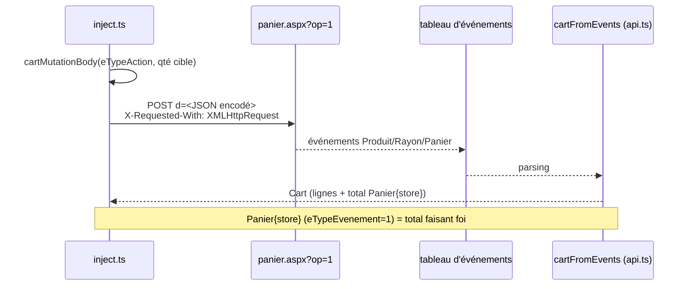
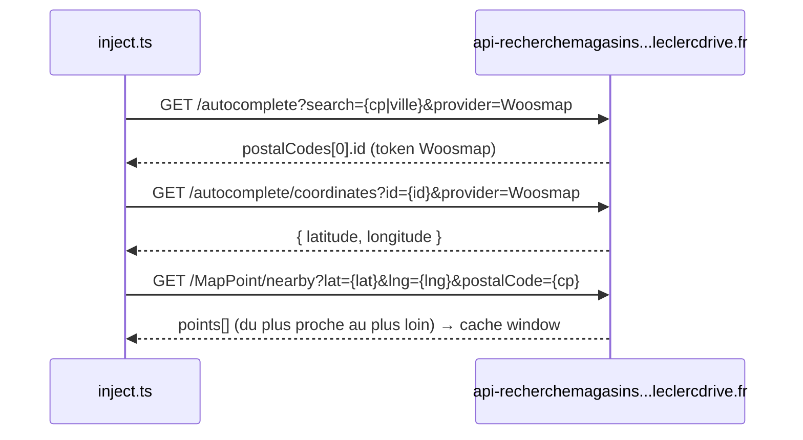

# Leclerc Drive — API逆向工程 (validée le 2026-06-13)

Capturée en direct sur le magasin **053701** (La Ville-aux-Dames) sur l'hôte
`fd9-courses.leclercdrive.fr`. Tous les endpoints ci-dessous ont été observés
ET rejoués avec succès depuis le contexte de la page avec
`credentials: 'include'` (cookies, dont DataDome, rejoués).

> Note sur les chemins : le chemin magasin est `magasin-{id}-{id}` pour l'API
> (ex. `magasin-053701-053701`). Le slug final `-La-Ville-aux-Dames` apparaît
> dans les URLs de page HTML mais est **cosmétique** — le backend se base sur
> l'id.

## 0. Auth / anti-bot

- La session repose sur les cookies. Toutefois, depuis le refactor WebMCP v1.0,
  **il n'y a plus de replay de cookies côté Node** : les outils s'exécutent dans
  l'onglet Chrome lui-même (MAIN world), donc `fetch` utilise les cookies
  authentiques du navigateur — voir `extension/inject.ts`.
- ⚠️ **DataDome** est actif (`api-js.datadome.co/js/`). Un cookie `datadome` fait
  partie de la session et doit être présent, sinon les requêtes sont challengées.
  Confirmé : un `fetch` Node à froid (sans cookies) reçoit **HTTP 403** avec un
  challenge DataDome ; depuis l'onglet connecté (cookies + `datadome` rejoués par
  le navigateur) la même URL retourne **HTTP 200**. Comme les outils tournent
  dans la page, le navigateur gère lui-même ce cookie et le rafraîchit.
- ⚠️ **Les rafales se font bloquer.** Observé en direct : déclencher ~5 mutations
  panier en parallèle déclenche immédiatement DataDome — les écritures *et* les
  lectures suivantes retournaient 403 pour ce client, tandis que la vraie session
  navigateur restait ok. Récupération : recharger Leclerc Drive dans Chrome
  (ré-émet un cookie `datadome` valide). Le injecteur sérialise +espace+  réessaie
  désormais toutes les requêtes pour éviter cela — voir `extension/inject.ts`
  (`throttled`, `retry`, `backoff`). Conserve une cadence humaine ; ne
  parallélise pas.
- Les requêtes mutantes envoient le header `X-Requested-With: XMLHttpRequest`
  et `Content-Type: application/x-www-form-urlencoded; charset=UTF-8`.

## 1. search_product — `GET .../recherche.aspx?TexteRecherche={query}`

- HTML rendu côté serveur (ASP.NET). **Pas de XHR de recherche séparée.**
- Nécessite le cookie de session (DataDome bloque les fetchs anonymes), mais pas
  de compte au-delà d'une session navigateur valide.
- Dans le **HTML brut**, les produits sont passés aux appels d'init de widgets
  comme
  `Utilitaires.widget.initOptions('..._pnlElementProduit', {"objContenu":{"lstElements":[{"objElement":{ ...iIdProduit... }}]}})`.
  (Le nom `_objDataSourceGroupeTrieFiltre` n'existe que comme global construit
  côté client à partir de ceci — ne pas se baser dessus côté serveur.) Le
  client extrait les produits en scannant le HTML à la recherche du plus petit
  objet JSON englobant chaque `iIdProduit` (= `objElement`, JSON pur). Validé en
  direct : `search("café")` → 200 produits. Chaque objet produit expose :

  | Champ | Signification |
  | --- | --- |
  | `iIdProduit` | **id produit** (utilisé pour toutes les op panier), ex. `2612` |
  | `sLibelleLigne1`, `sLibelleLigne2` | libellé (2 lignes) |
  | `nrPVUnitaireTTC` / `sPrixUnitaire` | prix unitaire (numérique / formaté) |
  | `sPrixPromo` | prix promo si applicable |
  | `nrPVParUniteDeMesureTTC` / `sPrixParUniteDeMesure` | prix au L/kg |
  | `iQteDisponible` | stock dispo (0 → indisponible) |
  | `iQuantitePanier` | quantité actuellement au panier |
  | `sUrlVignetteProduit` | URL vignette |
  | `iIdRayon`, `iIdFamille`, `niIdSousFamille` | ids de catégorie |

- Les images produit chargent aussi depuis
  `fd9-photos.leclercdrive.fr/image.ashx?id={photoId}&use=l&cat=p` et le
  Nutri-Score depuis `...&use=nsc` (note : photo id ≠ `iIdProduit`).

- L'extraction se fait via `scanProductRecords` + `smallestEnclosingObject`
  dans `src/leclerc/api.ts` (tolérant aux membres non-JSON comme les fonctions,
  skip si `JSON.parse` échoue).

## 2. add / update / remove — `POST .../panier.aspx?op=1`

Un seul endpoint pour toutes les mutations panier. `op=1` est constant.



- **Body** : `d=<JSON URL-encodé>` (un champ de formulaire nommé `d`).
- **Payload JSON** :

  ```json
  {
    "eTypeAction": 1,
    "iIdProduit": "2612",
    "iQuantite": 2,
    "sNoPointLivraison": "053701"
  }
  ```

  - `eTypeAction` : **1** = ajouter / augmenter, **2** = diminuer / retirer
    (voir `ACTION_ADD` / `ACTION_SUB` dans `src/leclerc/api.ts`).
  - `iQuantite` : la **nouvelle quantité absolue cible** (PAS un delta).
  - **Retirer** = `eTypeAction: 2`, `iQuantite: 0`. ✅ validé (panier passé à 0).
  - `objContexteProvenanceArticle` (contexte analytique) est **optionnel** — les
    retraits ont réussi sans lui. Non construit par le client.

- **Réponse** : tableau JSON d'événements. Les pertinents, indexés par
  `sIdUnique` :
  - `Produit{id}` (`eTypeEvenement` 101/103/104) : état par ligne —
    `iQuantitePanier`, `rTotalAPayer`/`sTotalAPayer` (total ligne).
  - `Rayon{id}` (503) : agrégat rayon.
  - **`Panier{store}` (`eTypeEvenement` 1) : total panier** —
    `iQuantitePanier` (nb articles), `rTotalAPayer`/`sTotalAPayer`,
    `sTotalHorsReductions`, `sMontantEconomies`, `fQuantiteDisponibleDepassee`.

  → Lire l'événement `Panier{store}` pour le total panier faisant foi après toute
  opération. L'assemblage se fait via `cartFromEvents` dans
  `src/leclerc/api.ts`.

## 3. get_cart

- `GET .../panier.aspx` (sans `op`) → **404**. Il n'y a pas de page panier simple
  à ce chemin.
- À la place, **chaque page magasin embarque le panier** dans le contexte
  « Panier » :
  - `"lstProduits":[ {enregistrements produit complets} ]` — `objElement`
    complets avec libellés, `iQuantitePanier`, et `rTotalAPayer`/`sTotalAPayer`
    par ligne.
  - `"lstProduitsLight":[ {"iIdProduit","iQtePanier","rTotalAPayer",...} ]` —
    un résumé léger (sans libellés), immédiatement suivi des totaux panier
    `"iQuantitePanier"`, `"sTotalHorsReductions"`, **`"sTotalAPayer"`** (total).
- Implémentation (validée en direct) : fetch
  `recherche.aspx?TexteRecherche=<token sans match>` (voir `NO_MATCH_QUERY`)
  afin que la page ne porte que les enregistrements panier, extraire le tableau
  `lstProduits` (clé exacte pour ne pas matcher `lstProduitsLight`) via
  `extractArrayNamed`, mapper chaque enregistrement, et lire le total depuis le
  `sTotalAPayer` adjacent à `lstProduitsLight` via `extractCartTotal`. Le tout
  dans `cartFromHtml` (`src/leclerc/api.ts`).
- Note : les lignes panier utilisent `iQuantitePanier` (liste complète) /
  `iQtePanier` (liste légère) — le client accepte les deux.

## 4. Store locator (find_stores) — `api-recherchemagasins.leclercdrive.fr`



Une API REST JSON propre (séparée des sites ASP.NET), validée en direct le
2026-06-13. Derrière DataDome comme le reste — depuis l'onglet connecté le cookie
`datadome` sur `.leclercdrive.fr` couvre ce sous-domaine. Base :
`https://api-recherchemagasins.leclercdrive.fr/API_RechercheMagasins/api/v1`
(voir `STORE_FINDER_API_BASE`).

Trois appels chaînés (constructeurs d'URL dans `src/leclerc/api.ts` :
`autocompleteUrl`, `coordinatesUrl`, `nearbyUrl`) :

1. `GET /autocomplete?search={cp|ville}&provider=Woosmap`
   → `{ postalCodes: [ { id, postalCode, city } ], pointsLivraisonParNom, ... }`.
   Prendre `postalCodes[0].id` (un token Woosmap opaque).
2. `GET /autocomplete/coordinates?id={id}&provider=Woosmap`
   → `{ latitude, longitude }` pour le lieu.
3. `GET /MapPoint/nearby?latitude={lat}&longitude={lng}&postalCode={cp}`
   → `{ points: [ store, ... ] }`, du plus proche au plus loin.

Chaque `point` porte : `name`, **`noPL`** (id magasin, chaîne zéro-padded),
**`noPR`** (point de retrait ; == noPL pour les drives), `serviceType`
(`drive` / `relais` / `livraison`), `distance` (km), `postalCode`,
`coordinates {latitude, longitude}`, et **`urlSiteCourse` / `urlBase`** —
l'hôte de courses du magasin (ex. `fd8`/`fd9`/`fd14-courses.leclercdrive.fr`,
**varie par magasin**). Le client mappe ceci dans le `ActiveStore` actif
(voir `extension/inject.ts` — `loadStore`/`setStore`, et `hostOf`/`isLeclercHost`
dans `src/leclerc/api.ts`).

⚠️ **La session est liée à un seul drive.** Les courses (recherche/panier) ne
marchent que sur le drive où la session Chrome est actuellement connectée.
`set_store` sur un magasin où le navigateur n'est pas branché retourne une page
« session expirée ». Rejouer l'appel « switch drive » de Leclerc pour relier la
session côté serveur reste un sujet ouvert (permettrait à `set_store` de
pointer vers n'importe quel drive) — voir ci-dessous.

## 5. list_habitual_products — `.../produits-habituels.aspx`

- Page HTML rendue côté serveur liée à la session (page « produits habitués »
  du magasin courant).
- L'URL se dérive depuis le préfixe magasin de l'URL courante de l'onglet :
  `/magasin-<id>-<id>-<slug>/produits-habituels.aspx` — voir
  `extension/inject.ts` (`list_habitual_products`).
- Le parsing réutilise `productsFromHtml` (`src/leclerc/api.ts`) — même scanner
  `iIdProduit` que pour la recherche.

## Points ouverts / à affiner

- Confirmer que `objContexteProvenanceArticle` peut être totalement omis sur
  **add** (uniquement vérifié omittable sur remove).
- Trouver un endpoint panier en lecture seule propre s'il en existe un (éviter
  le scrape HTML) — aujourd'hui `get_cart` fetch une page recherche sans match.
- Durée de vie du cookie DataDome / comportement de refresh pour les sessions
  longues.
- **Ingénierie inverse de l'appel « switch drive »** pour que `set_store`
  puisse relier la session à n'importe quel drive côté serveur (aujourd'hui il
  doit correspondre au drive du navigateur).
- Flux de checkout / réservation de créneau (hors périmètre).