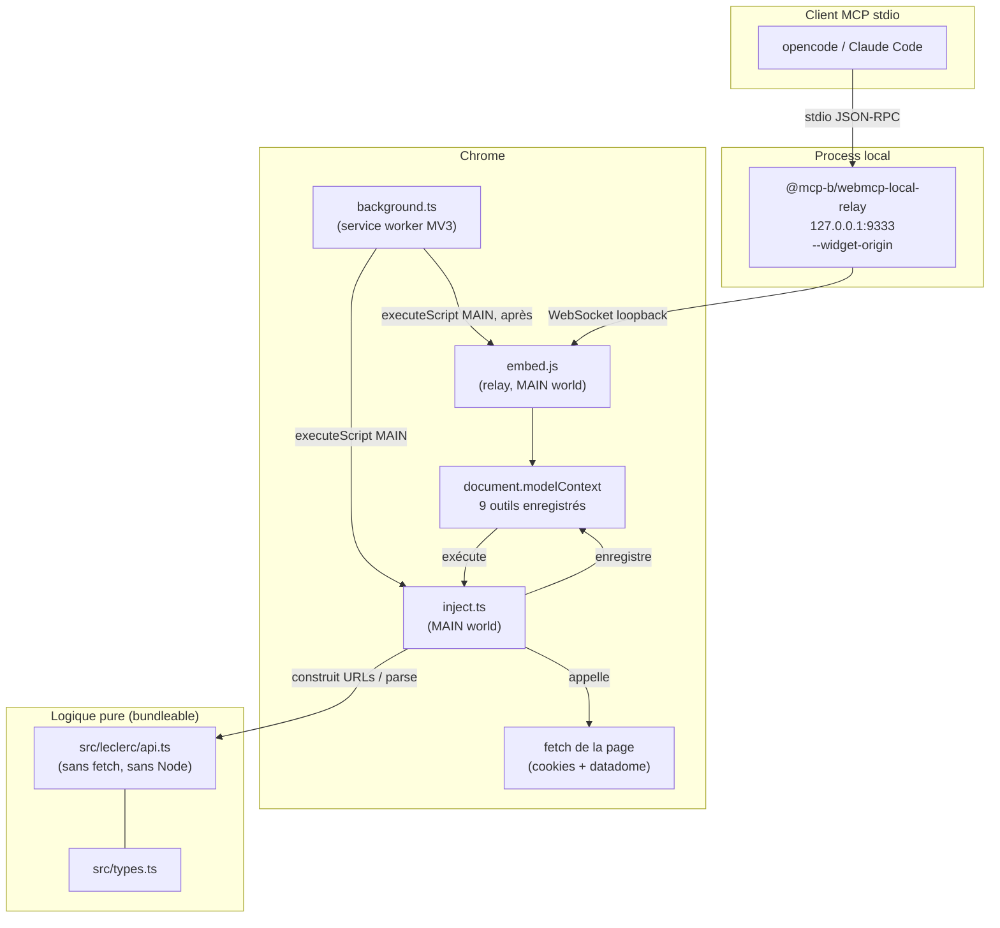
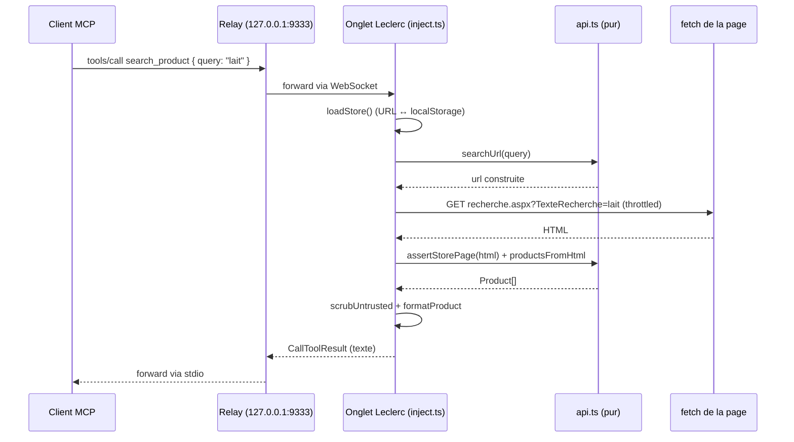

# Architecture

Comment `mcp-leclerc-drive` est assemblé sous le modèle **WebMCP** (v1.0.0).

## Composants

### 1. L'extension Chrome MV3 (`extension/`)

L'artefact livré vit dans `dist/extension/` après `npm run build:extension`.

- **`manifest.json`** — Manifest V3. Permissions : `scripting`, `activeTab`,
  `storage` ; host permissions restreints à `*://*.leclercdrive.fr/*` uniquement.
  Pas de `cookies`, pas de `tabs`, pas de `<all_urls>`.
- **`background.ts`** (service worker) — écoute `chrome.tabs.onUpdated` pour
  les navigations Leclerc Drive (`hostSuffix: leclercdrive.fr`) et, sur
  `complete`, injecte `["inject.js", "embed.js"]` dans le **MAIN world** de
  l'onglet via `chrome.scripting.executeScript`. Ré-injecte aussi dans les
  onglets Leclerc déjà ouverts sur `onStartup` / `onInstalled`. Pose un badge
  (`ON` vert / `ERR` rouge).
- **`inject.ts`** (tourne dans le MAIN world de la page) — installe
  `document.modelContext` via `@mcp-b/global` (`initializeWebModelContext`,
  auto-init des transports Tab + Iframe), puis y enregistre les 9 outils
  Leclerc. Gardé par `window.__mcpLeclercDriveInjected` donc idempotent. Possède
  le **throttle** in-page (sérialise + space + jitter + retry/backoff sur
  403/429) et les seuls appels `fetch` du projet.
- **`embed.js`** — vendored depuis `@mcp-b/webmcp-local-relay/dist/browser/embed.js`
  au build ([`scripts/build-extension.mjs`](../scripts/build-extension.mjs)).
  Ouvre le WebSocket vers le relay local et forward les outils enregistrés comme
  outils MCP first-class. Injecté *après* `inject.js` pour qu'il voie un
  `document.modelContext` prêt.

> Les scripts MAIN world ne peuvent pas utiliser les API `chrome.*`, donc tout
> ce qui est lié à chrome (le relay embed) est piloté purement via **l'ordre de
> la liste** dans le background worker. `inject.ts` n'injecte jamais `embed.js`
> lui-même.

### 2. Logique métier pure (`src/leclerc/api.ts`)

Construction d'URLs, parsing HTML/JSON, assemblage du panier, helpers du
store-finder, formatage. **Pas de `fetch`, pas de Node, pas de storage
navigateur.** C'est ce qui permet de la bundler dans le content script MV3 et
de la unit-tester en isolation. Le tsconfig de l'extension
(`tsconfig.extension.json`) inclut ce fichier plus `src/types.ts`.

Points-clés :
- `searchUrl` / `cartUrl` / `storePath` — construction d'URL drive (le slug est
  cosmétique, le backend key off `magasin-{storeId}-{noPR}`).
- `assertStorePage` — garde DataDome / session expirée : toute vraie page
  magasin porte `lstProduitsLight` ; si absent, lever un message actionnable.
- `extractArrayNamed` / `scanProductRecords` / `smallestEnclosingObject` —
  extraction tolérante des enregistrements produit depuis des littéraux JS qui
  peuvent contenir des membres non-JSON.
- `cartFromHtml` / `cartFromEvents` — assemblent un `Cart` soit depuis une page
  de recherche (tableau JSON d'événements POST), soit depuis une page de
  recherche sans match (scrape HTML).
- `cartMutationBody` — construit le body de form `d=<JSON URL-encodé>`.
- `autocompleteUrl` / `coordinatesUrl` / `nearbyUrl` — URLs REST du store-finder.
- `isLeclercHost` (`/^fd\d+-courses\.leclercdrive\.fr$/`) — la porte SSRF.

### 3. Types domaine (`src/types.ts`)

`Product`, `CartItem`, `Cart` — les formes que les outils exposent au modèle.
Les shapes brutes backend (`RawProduct`, `CartEvent`) vivent dans `api.ts` et
sont mappées par `mapProduct` / `cartFrom*`.

### 4. Le relay local (`@mcp-b/webmcp-local-relay`, dev dependency)

Un process Node local lancé par le client MCP (opencode / Claude Code) sur
stdio. Il écoute sur `127.0.0.1:9333` et ponte WebSocket ↔ stdio JSON-RPC.
Configuré par drive avec `--widget-origin https://fdN-courses.leclercdrive.fr`
pour que seule ta page Leclerc puisse enregistrer des outils.

### 5. Registry + métadonnées de config

- [`server.json`](../server.json) — métadonnées du registry MCP
  (`io.github.maurice30120/leclerc-drive`). Annonce explicitement qu'il s'agit d'un
  *relay WebMCP*, pas d'un serveur stdio classique.
- [`opencode.example.jsonc`](../opencode.example.jsonc) — template de config
  MCP drop-in. [`opencode.jsonc`](../opencode.jsonc) est la copie dev locale.

## Flux de données (un appel `search_product`)

Étapes détaillées :

1. Le client MCP envoie `tools/call search_product { query: "lait" }` sur stdio.
2. Le relay le forward sur le WebSocket vers l'onglet Leclerc connecté (la source).
3. `embed.js` le délivre à `document.modelContext`, qui dispatch vers
   l'exécuteur `search_product` enregistré dans `inject.ts`.
4. `inject.ts` résout le magasin actif (`loadStore` → URL `localStorage` ↔
   `window.location`), construit `searchUrl(…)` via `api.ts`, et appelle
   `getHtml` — le propre `fetch` de la page avec `credentials: "include"`,
   throttlé.
5. `assertStorePage` valider le HTML ; `productsFromHtml` parse les
   enregistrements produit.
6. Les libellés passent par `scrubUntrusted` (strip `<system>` /
   `<|im_start|>`-style) puis `formatProduct`.
7. Le `CallToolResult` textuel remonte le même chemin vers le client MCP.

## Build

`scripts/build-extension.mjs` (esbuild, pas de Vite) :
- substitue `{{EXTENSION_VERSION}}` dans le manifest depuis `package.json`,
- bundle `extension/inject.ts` et `extension/background.ts` en IIFE (les
  scripts classiques MV3 ne peuvent pas être ESM-as-module dans le service
  worker sans précaution),
- vendor `embed.js` depuis le package relay pour que l'extension fonctionne
  offline, sans dépendance CDN au runtime.

Les sorties vont dans `dist/extension/`. `npm run build:all` lance aussi `tsc`
pour les types dist.