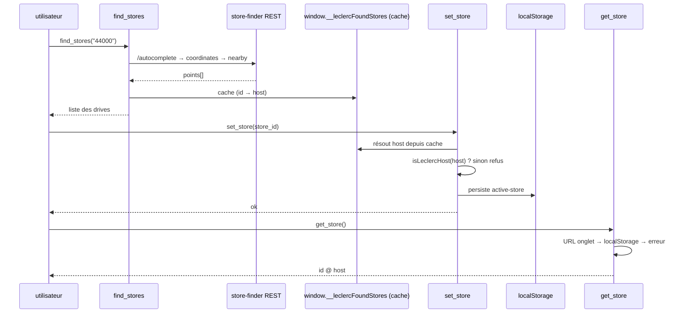

# Référence des outils

Les 9 outils MCP enregistrés sur `document.modelContext` par
`extension/inject.ts`. Tous tournent **dans l'onglet Leclerc Drive connecté**,
en utilisant le propre `fetch` de la page.

Les noms d'outils sont stables. Les entrées sont du JSON-Schema. Les
annotations suivent les hints `@modelcontextprotocol`.

## Sélection du magasin

### `find_stores(query)`
Trouve les drives proches d'un code postal ou d'une ville.
- Appels chaînés à l'API REST du store-finder : `/autocomplete` →
  `/autocomplete/coordinates` → `/MapPoint/nearby`.
- Retourne une ligne par drive : `name — serviceType (id=… @ host)`.
- Met en cache les résultats sur `window.__leclercFoundStores` pour `set_store`.
- Annotations : `readOnlyHint`, `untrustedContentHint` (les noms de magasins
  proviennent de Leclerc), `openWorldHint`.

### `set_store(store_id, host?)`
Sélectionne et persiste le drive actif.
- Résout l'hôte depuis le cache `find_stores`, ou accepte un `host` explicite.
- Valide `isLeclercHost` → refuse les hôtes non-Leclerc (porte SSRF).
- Persiste dans `localStorage` sous `mcp-leclerc-drive:active-store`, scopé à
  l'hôte Leclerc.
- Annotations : `openWorldHint` (mute la sélection ; non destructif pour le
  panier).

> ⚠️ La session est liée à un seul drive. Le magasin que tu set doit être celui
> sur lequel l'onglet navigateur est connecté, sinon les appels panier/recherche
> retournent « session expirée ».

### `get_store()`
Affiche le magasin actuellement sélectionné (`id @ host`).
- Résolution : URL de l'onglet → `localStorage` persisté → erreur.
- Annotations : `readOnlyHint`.



## Catalogue

### `search_product(query)`
Recherche dans le catalogue du magasin actif.
- `GET recherche.aspx?TexteRecherche=…` → parse les enregistrements
  `iIdProduit` via `productsFromHtml`.
- Retourne `libellé (marque) — prix € [prixParUnité] Nutri-Score … id=…`.
- Annotations : `readOnlyHint`, `untrustedContentHint`, `openWorldHint`.

### `list_habitual_products()`
Liste tes « produits habitués » (page `produits-habituels.aspx` du drive).
- Déduit le préfixe du chemin magasin depuis **l'URL courante de l'onglet**
  (`/magasin-<id>-<id>-<slug>/`), donc l'onglet doit être sur une page magasin.
- Annotations : `readOnlyHint`, `untrustedContentHint`, `openWorldHint`.

## Panier

### `add_to_cart(product_id, quantity?)`
Ajoute un produit (utilise l'`id` de `search_product`). Défaut `quantity=1`,
entier ≥ 1.
- `POST panier.aspx?op=1` avec `cartMutationBody(…, ACTION_ADD=1, qté cible)`.
- Parse le tableau d'événements avec `cartFromEvents` → retourne le panier
  complet.
- Annotations : `destructiveHint: false`, `idempotentHint: true`,
  `openWorldHint`.

### `remove_from_cart(product_id)`
Retire une ligne entièrement.
- `eTypeAction=2`, `iQuantite=0` (validé contre le panier live).
- Annotations : `destructiveHint: true`, `openWorldHint`.

### `update_quantity(product_id, quantity)`
Définit la quantité absolue d'une ligne (0 = retire).
- Lit la quantité courante (`currentQuantity` → `get_cart` HTML) pour choisir
  `ACTION_ADD` vs `ACTION_SUB` (le `iQuantite` de Leclerc est la cible absolue).
- Annotations : `destructiveHint: true`, `openWorldHint`.

### `get_cart()`
Lit le panier complet avec le total.
- `GET recherche.aspx?TexteRecherche=<no-match>` pour que la page ne porte que
  les enregistrements panier, puis `cartFromHtml`.
- Annotations : `readOnlyHint`, `openWorldHint`.

```mermaid
stateDiagram-v2
    [*] --> Absent
    Absent --> DansPanier: add_to_cart(q>=1)
    DansPanier --> DansPanier: update_quantity(q) (q>=1)
    DansPanier --> Absent: remove_from_cart
    DansPanier --> Absent: update_quantity(0)

    state DansPanier {
        [*] --> QtyCourante
        QtyCourante --> QtyCourante: add (ACTION_ADD, qté cible)
        QtyCourante --> QtyCourante: update (ADD ou SUB selon delta)
    }

    note right of Absent: iQuantite=0
    note right of dansPanier: iQuantite=q cible (absolu, non delta)
```

## Comportement transverse

- **Throttle anti-DataDome** (`inject.ts`) : sérialise +
  `MIN_INTERVAL_MS=600` + jitter `JITTER_MS=250` + `MAX_RETRIES=3` avec backoff
  exponentiel sur `403`/`429`. Chaque fetch est le propre fetch de la page,
  donc l'empreinte est réelle et les strikes sont rares.
- **Garde anti-bloc** : `assertStorePage`lève un message actionnable « recharge
  l'onglet » sur une page DataDome / session expirée au lieu de retourner du
  vide.
- **Épuration anti-injection de prompt** : la sortie de `search_product`,
  `find_stores`, `list_habitual_products` passe par `scrubUntrusted` (décode les
  entités + strip `<system>` / `<|im_start|>` / marqueurs style `[tool]`).
- **Erreurs** : retournées comme `CallToolResult` avec `isError: true` et un
  message actionnable en français.